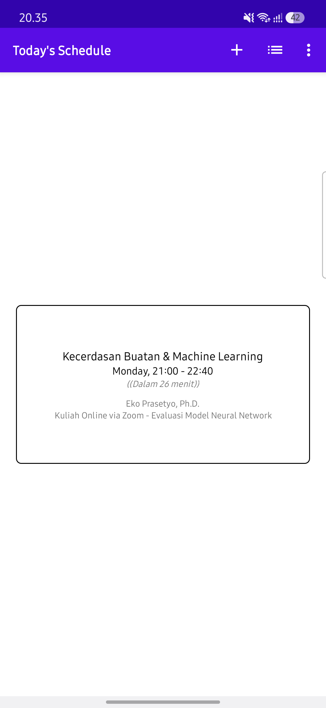
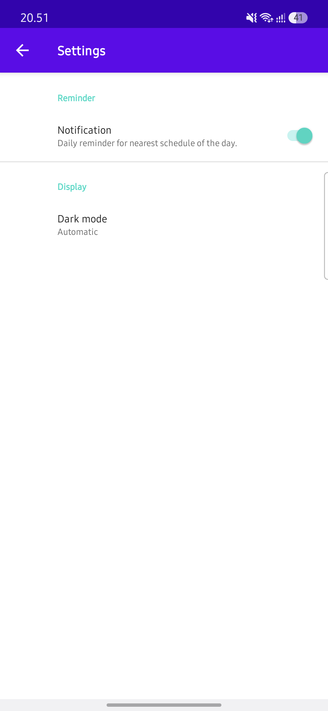
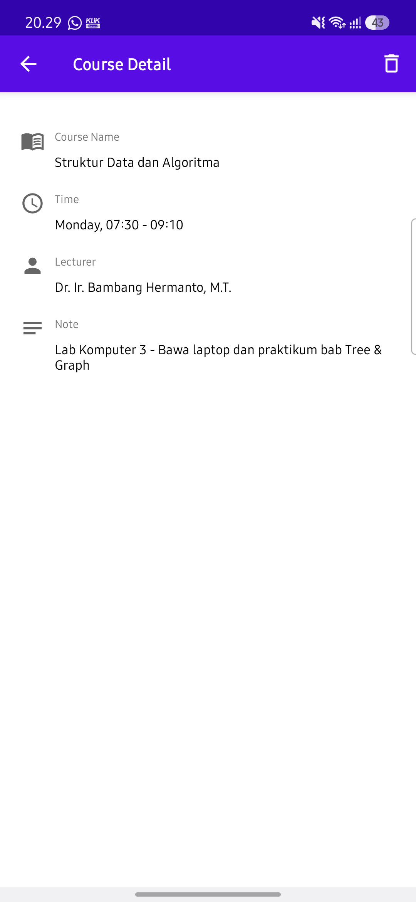
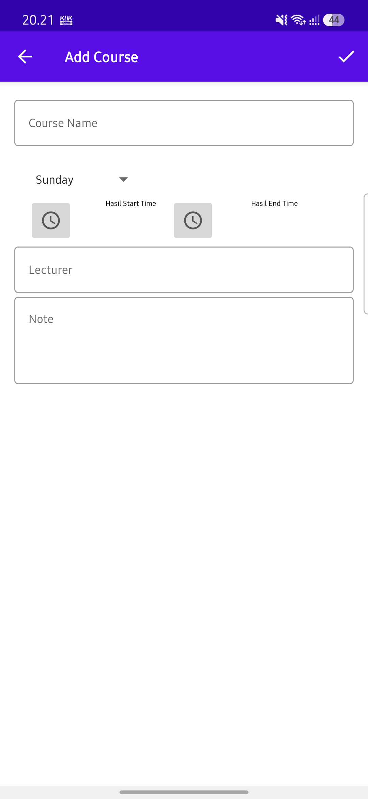
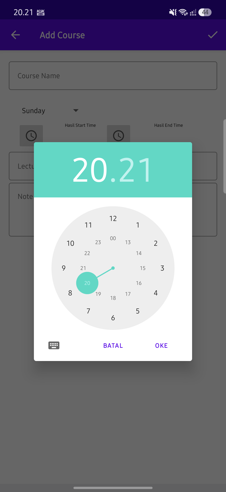

# 📚 Course Schedule App (Android Architecture Component)

Aplikasi manajemen jadwal kuliah modern berbasis Android Native dengan arsitektur **MVVM (Model-View-ViewModel)**, **Android Jetpack**, **Room Database with Pre-populated Data**, **Paging**, dan **Daily Reminder Notification (AlarmManager & BroadcastReceiver)**.

---

## 📱 Screenshots

| Home (Jadwal Terdekat) | Daftar Jadwal Kuliah | Detail Jadwal |
|:---:|:---:|:---:|
|  |  |  |

| Tambah Jadwal Kuliah | Time Picker Dialog | Pengaturan & Tema |
|:---:|:---:|:---:|
|  |  |  |

---

## 🚀 Fitur Utama & Alur Garis Besar Aplikasi

### 1. **Beranda & Smart Next Schedule (`HomeActivity`)**
* **Alur:** Saat aplikasi dibuka, sistem otomatis mendeteksi hari dan jam saat ini (`Calendar.getInstance()`).
* **Fitur:** Menampilkan kartu jadwal kuliah **terdekat yang akan datang** pada hari ini (misal: *"Kecerdasan Buatan & Machine Learning (Dalam 25 menit)"*). Jika seluruh jadwal hari ini telah selesai atau tidak ada kuliah, kartu menampilkan pesan bahwa tidak ada jadwal aktif.
* Terdapat shortcut navigasi cepat untuk membuka daftar lengkap jadwal (`ListActivity`) dan tombol tambah jadwal (`AddCourseActivity`).

### 2. **Daftar Kuliah & Paging (`ListActivity`)**
* **Alur:** Menggunakan `PagedList` dari **Android Jetpack Paging** untuk memuat daftar mata kuliah secara bertahap, ringan, dan efisien.
* **Fitur Sorting:** Pengguna dapat mengurutkan daftar secara instan berdasarkan:
  * ⏰ **Waktu Kuliah (`SortType.TIME`)**
  * 🔤 **Nama Mata Kuliah (`SortType.COURSE_NAME`)**
  * 👨‍🏫 **Nama Dosen Pengampu (`SortType.LECTURER`)**
* **Swipe to Delete:** Fitur hapus cepat dengan menggeser (swipe) kartu ke kiri/kanan menggunakan `ItemTouchHelper`.

### 3. **Detail Informasi Mata Kuliah (`DetailActivity`)**
* Menampilkan informasi lengkap mata kuliah yang dipilih: nama matkul, hari, rentang waktu (jam mulai - selesai), nama dosen pengampu, serta catatan/ruangan lab.
* Dilengkapi tombol aksi konfirmasi hapus pada Action Bar.

### 4. **Tambah Jadwal Baru (`AddCourseActivity`)**
* Form input terstruktur dengan:
  * Input Nama Mata Kuliah & Dosen.
  * Pilihan Hari (Dropdown / Spinner).
  * **Time Picker Dialog** interaktif untuk memilih jam mulai dan jam selesai kuliah.
  * Catatan tambahan / lokasi kelas.

### 5. **Daily Reminder & Notifikasi (`DailyReminder`)**
* Menggunakan `AlarmManager` dan `BroadcastReceiver` yang dijadwalkan setiap jam 06:00 pagi.
* Menghasilkan **Inbox-Style Notification** yang merangkum seluruh agenda mata kuliah hari tersebut.
* Kompatibel penuh dengan standar Android modern (**Android 12 s.d. Android 15** menggunakan `POST_NOTIFICATIONS` dan `FLAG_IMMUTABLE`).

### 6. **Pengaturan Tema & Preferensi (`SettingsActivity`)**
* **Dark Mode:** Opsi tema Gelap, Terang, atau Otomatis mengikuti preferensi sistem (`AppCompatDelegate`).
* **Reminder Toggle:** Switch preferensi untuk mengaktifkan atau menonaktifkan alarm harian.

---

## 🏗️ Arsitektur & Teknologi

* **Bahasa:** Kotlin
* **Arsitektur:** MVVM (Model-View-ViewModel) + Repository Pattern
* **Database:** Room Persistence Library (SQLite ORM) dengan Auto-Seeding 20 Data Awal
* **Pagination:** Android Jetpack Paging Library (`PagedList`, `DataSourceFactory`)
* **Async Processing:** Kotlin Coroutines & Background Executors
* **Background Task:** `AlarmManager` & `BroadcastReceiver`
* **UI Components:** Material Design 3, CoordinatorLayout, CardView, PreferenceFragmentCompat

---

## 📊 Data Dummy (20 Sampel Jadwal)

Database aplikasi sudah otomatis terisi **20 data jadwal kuliah realistis** yang mencakup:
* ✅ **Jadwal yang telah terlewat** (Pagi & Siang)
* ⏳ **Jadwal yang akan datang** (Sore & Malam)
* 📅 **Jadwal bervariasi dari hari Senin sampai Minggu** agar fitur pencarian, filter, sorting, dan notifikasi dapat langsung diuji secara maksimal.

---

## 🛠️ Cara Menjalankan Project

1. Clone repositori ini:
   ```bash
   git clone https://github.com/nurauliakarisma/Course_Schedule_AAD.git
   ```
2. Buka project di **Android Studio**.
3. Pastikan konfigurasi Gradle menggunakan **JDK 17**.
4. Lakukan **Sync Project with Gradle Files**.
5. Jalankan aplikasi pada Emulator atau Perangkat Fisik Android.

---

## 👨‍💻 Submission Info
Project submission untuk modul **Belajar Fundamental Aplikasi Android (AAD)** - Dicoding Indonesia.
